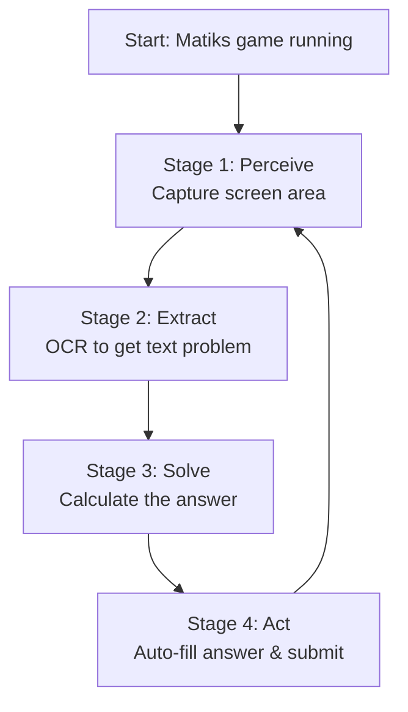

I want to learn how to build such low latency application and what tech stacks to use for best performance. I want to learn that.

Building a high-performance "auto-solver" overlay is an excellent project to learn about modern Android automation. The core of this app is a **perception-action loop**: it repeatedly sees the screen, thinks of an answer, and takes action.

This guide breaks down the architecture and tech stack for low-latency performance, using tools that don't require rooting your device.

### 🧩 The Architecture: A Four-Part System

Think of your app as a loop with four key stages:

1.  **Perceive (Sight):** Capture the current screen where the math problem is.
2.  **Extract (Reading):** Use Optical Character Recognition (OCR) to turn the image of the problem into a text string (e.g., "35 + 27").
3.  **Solve (Thinking):** Parse the text and quickly calculate the answer.
4.  **Act (Action):** Automatically input the answer into the game's answer field.

The following flowchart illustrates how these four stages work together in a continuous loop to solve each math problem:

Now, let's dive into each stage and explore the best tools for the job.

### 1. 👁️ Perceive: Low-Latency Screen Capture

This is the starting point. Your app needs to "see" the screen as fast as possible. There are two main ways to do this without root access.

| Technology | How it Works | Performance |
| :--- | :--- | :--- |
| **MediaProjection API** | The system-level screen recording API. It creates a `VirtualDisplay` that you can capture frames from. | **High Performance** Provides raw, low-level access to screen buffers, making it the fastest option. Perfect for frame-by-frame capture. |
| **Accessibility Service** | A service designed for accessibility tools that can listen for events and inspect the UI's view hierarchy. | **Moderate** Potentially faster for simple text retrieval, but it reads the UI structure, not raw pixels. It can be less reliable for games with custom-rendered graphics. |

**Recommendation:** **MediaProjection** is the way to go for the speed and precision needed in a fast-paced game.

### 2. 👓 Extract: The Best OCR Engine for Speed

Once you have a screen frame, you need to extract the text. The choice of OCR engine is crucial for latency.

| OCR Engine | Key Features |
| :--- | :--- |
| **Google ML Kit Text Recognition** | A production-ready SDK from Google. It's highly optimized for mobile devices with excellent speed and accuracy, and it works offline. This is the recommended choice for most projects. |
| **PaddleOCR-mobile** | An open-source, lightweight CNN model that can be extremely accurate (92% accuracy in some tests) and fast (≈620ms per frame). A great option if you want to customize the model. |
| **Tesseract OCR** | The classic, fully open-source engine. However, it's older, slower (≈800ms per frame), and generally less accurate on mobile devices compared to ML Kit. Best for learning or specific use cases. |

**Recommendation:** Start with **Google ML Kit**. It's the most balanced choice for high-performance mobile OCR, offering a great mix of speed and accuracy out of the box.

### 3. 🧠 Solve: Lightning-Fast Math Parsing

For basic arithmetic, you don't need a heavy math library. You can write your own simple parser in Kotlin or Java. This will be incredibly fast and lightweight.

**What to learn:** You'll need to learn how to parse a string (e.g., "35 + 27") and break it down into its components (numbers and operator). Kotlin, with its concise syntax, is excellent for this.

### 4. 🖱️ Act: Automating Input with Precision

Once you have the answer, you need to get it into the game.

| Technology | How it works | Notes |
| :--- | :--- | :--- |
| **Accessibility Service (again!)** | This service has powerful `performAction()` methods that can find a UI element (like an input box) and interact with it directly. | This is the **most reliable method** for clicking and typing. |
| **AutoGod Framework** | A powerful, all-in-one framework built on top of AccessibilityService, offering a simpler way to code complex automation tasks. | Great for speeding up development. |
| **Root-based Injection** | Directly injects touch and input events into the system. | This would be the absolute fastest, but it **requires a rooted device**, which is a major barrier for most users. |

**Recommendation:** **AccessibilityService** is the standard and most robust way to perform UI actions. It's non-root and well-supported across Android versions.

### 🏗️ Putting It All Together: The Tech Stack

Here is the complete tech stack that balances high performance with practical development.

*   **Primary Language:** **Kotlin**. It's the modern, preferred language for Android development and is designed for safe, expressive, and concise code.
*   **Core Technologies:**
    *   **Screen Capture:** `android.media.projection.MediaProjection` API.
    *   **Text Extraction (OCR):** `com.google.mlkit:text-recognition` SDK.
    *   **Automation Actions:** `android.accessibilityservice.AccessibilityService`.
*   **The Overlay:** `android.view.WindowManager` with `WindowManager.LayoutParams.TYPE_APPLICATION_OVERLAY`. For an overlay that's truly always-on-top, you can even use the specialized `TYPE_ACCESSIBILITY_OVERLAY`.
*   **Learning Resources:**
    *   **Official Documentation:** The Android Developer guides for MediaProjection, ML Kit, and AccessibilityService are your bibles.
    *   **Open-Source Projects:** Studying projects like **AutoGod**, **ScanSearch**, and **小木自动点击器** can provide invaluable real-world insights into how these systems are built.
    *   **Alternative Tool:** **Tasker** (with the **AutoInput** plugin) is a great way to prototype your automation logic and understand the concepts before writing a single line of code.

### 🚀 Pro Tips for Peak Performance

To get that last millisecond of speed, consider these optimization techniques:

1.  **Targeted Capture:** Don't capture the whole screen. Use the coordinates of the game's question area. This dramatically reduces the data your OCR engine needs to process.
2.  **Asynchronous Processing:** Keep your UI thread smooth by doing all the heavy lifting (OCR, solving) on background threads using `Coroutines` or `RxJava`.
3.  **Image Preprocessing:** Before sending an image to the OCR engine, you can process it to improve results. Simple techniques like converting to **grayscale** or applying a **binary threshold (black and white)** can boost both speed and accuracy.
4.  **Smart Caching:** If the same problem appears twice, cache the answer. This saves you from OCR and calculation for repeated questions.

### ⚠️ A Final Note on Ethics

Building this is a fantastic technical challenge. However, it's important to be aware that using such a tool to gain an unfair advantage in a competitive game like *Matiks* would almost certainly violate the app's **Terms of Service**.

I recommend building this as a personal learning project and for use against AI opponents. Using it in competitive play could lead to a ban. Understanding these limitations is all part of being a responsible developer.

I hope this roadmap gives you a clear path forward. It's an ambitious project, but breaking it down into these core components makes it much more approachable. As you start building, you'll likely have more specific questions about each piece. Feel free to ask!